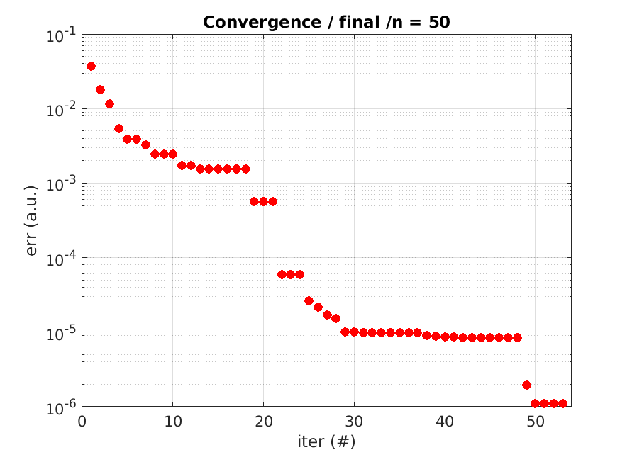
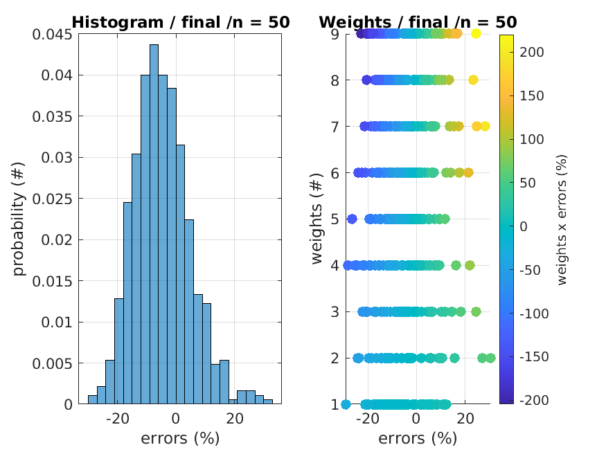

# MATLAB Toolbox for Global Fitting/Optimization

This **MATLAB toolbox** can be used for the following problems:
* finding **global minimum** of a function
* **fitting a function** to a dataset

This toolbox is specially adapted to the **following problems**:
* **non-smooth** error function
* **non-convex** error function
* **computationally heavy** error function
* error function with **local minima**
* error function with **many input variables**

This toolbox provides a common interface for **different solvers**:
* **gradient**: fminunc / fmincon
* **simplex**: fminsearch
* **surrogate**: surrogateopt
* **evolutionary**: particleswarm / ga
* the aforementioned solvers can be **combined**

Customized **error function**:
* custom **weights** for the dataset points
* choice of the **error metric** (norm, average, percentile, etc.)
* recover from **undefined values**
* **vectorized evaluation** of the error function
* **parallel evaluation** of the error function
* **caching** of the error function

Advanced **variable handling**:
* **abstraction layer** for the variables
* **initial** values
* **scalar or vector** variables
* variable **transformation** (linear, quadratic, logarithmic, etc.)
* variable **normalization**
* **constraints** (lower and upper bounds)
* **sine transformation** for handling constraints

Advanced **monitoring** capabilities:
* compute various error metrics
* compute solver figures of merit
* plot/display the solver progress
* plot/display the final results

## Limitations

* All the provided features have a **computational cost**.
* Therefore, this library is mostly adapted to **time-consuming error functions**.
* For simple error functions, the **overhead is non-negligible**.

## Examples

* [run_example_fitting.m](run_example_fitting.m) - Simple fitting of a model with respect to a dataset.
* [run_example_optim.m](run_example_optim.m) - Find the global minimum of a function.

    
    

## Compatibility

* Tested with MATLAB R2021a.
* The `gads_toolbox` is required (for the MATLAB solvers).
* The `optimization_toolbox` is required (for the MATLAB solvers).
* The `distrib_computing_toolbox` is required (for parfor loops)
* Compatibility with GNU Octave not tested but probably problematic.

## Author

**Thomas Guillod** - [GitHub Profile](https://github.com/otvam)

## License

This project is licensed under the **BSD License**, see [LICENSE.md](LICENSE.md).
